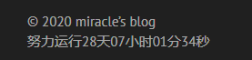
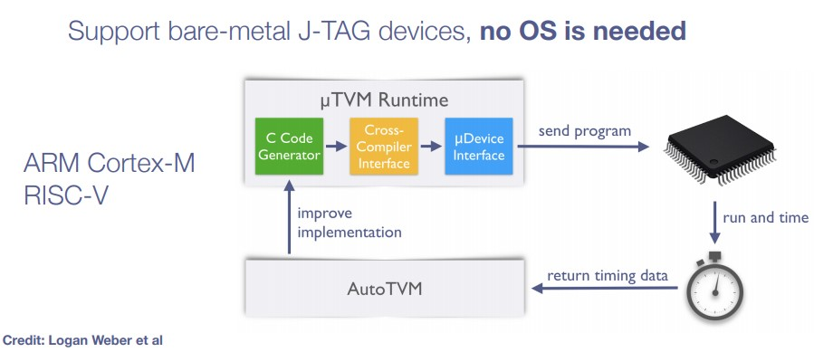

## 前前序
自建立博客开始已经整整过去了28天之久，终于要迎来我的第一篇正式博客了。确实是拖了挺久，但确实是希望能总结出有点质量和有意义的东西，所以还是慢工出细活吧（虽然可能也不是很细）

## 前序
之前在知乎上看过一篇文章——[《如何看待程序员的三大浪漫被认为是操作系统、编译原理和图形学？》](https://www.zhihu.com/question/27323148/answer/36153626)，里面有一句很经典的话，浪漫自古
## 编译原理

